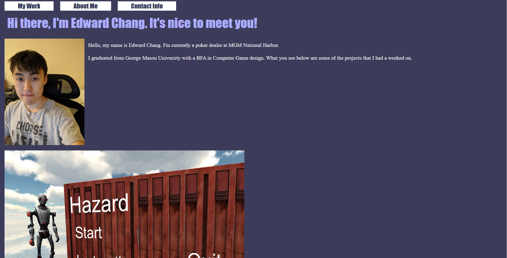

# mod2chal
## Description

Motivation behind this project was to make something from scratch utliziing everything we had learned. This project was made to show what I had learned so far in the classes, and to bring attention to any weak points in my learning so far. I learned that labeling a div with a class/id has to match the element's class/id correctly, how to resize images. 

## Installation

Just go to: https://ednihilator.github.io/mod2chal/

## Usage

Provide instructions and examples for use. Include screenshots as needed.

To add a screenshot, create an `assets/images` folder in your repository and upload your screenshot to it. Then, using the relative filepath, add it to your README using the following syntax:

    
    

## License

The last section of a high-quality README file is the license. This lets other developers know what they can and cannot do with your project. If you need help choosing a license, refer to [https://choosealicense.com/](https://choosealicense.com/).

---
